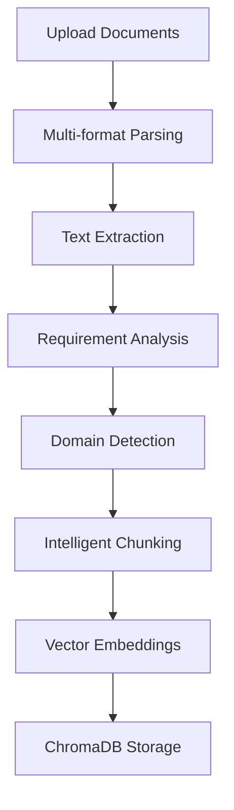
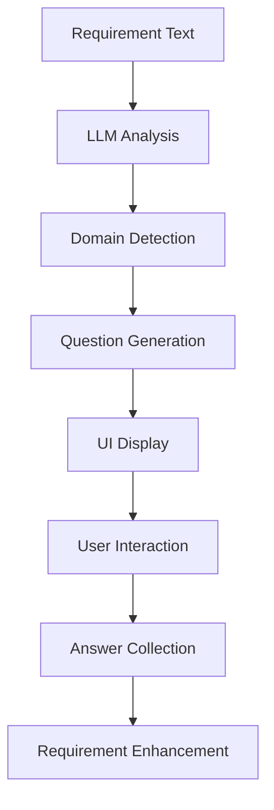
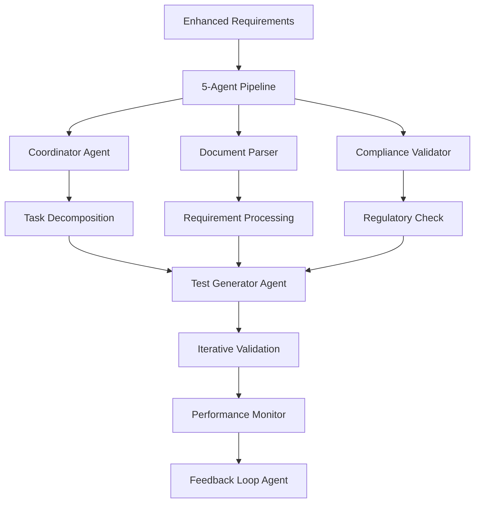
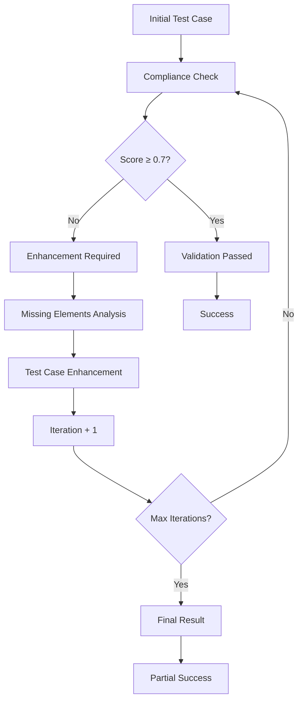
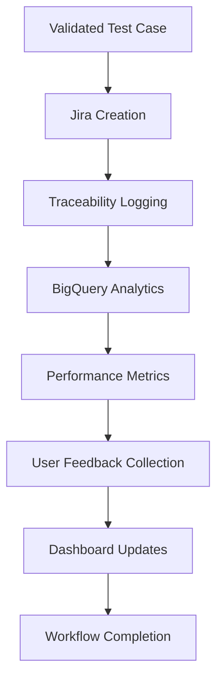

# Multi-Agent RAG Test Case Generation System
## Comprehensive Features, Workflow & Documentation

---

## 🏗️ **SYSTEM ARCHITECTURE**

### **Core Components**
```
┌─────────────────────────────────────────────────────────────────┐
│                    STREAMLIT UI LAYER                          │
├─────────────────────────────────────────────────────────────────┤
│  📁 File Upload  │  🤖 AI Questions  │  📊 Dashboard  │  📚 Docs │
└─────────────────────────────────────────────────────────────────┘
                                │
┌─────────────────────────────────────────────────────────────────┐
│                 ORCHESTRATOR LAYER                              │
├─────────────────────────────────────────────────────────────────┤
│  🎯 WorkflowOrchestrator  │  ⚡ Performance Monitor  │  🔄 State │
└─────────────────────────────────────────────────────────────────┘
                                │
┌─────────────────────────────────────────────────────────────────┐
│                   5-AGENT SYSTEM                               │
├─────────────────────────────────────────────────────────────────┤
│ 📄 DocumentParser │ 🧪 TestGenerator │ 💬 FeedbackLoop │ ✅ Compliance │ 📈 Performance │ 🎯 Coordinator │
└─────────────────────────────────────────────────────────────────┘
                                │
┌─────────────────────────────────────────────────────────────────┐
│                    TOOLS & SERVICES                            │
├─────────────────────────────────────────────────────────────────┤
│ 🧠 AI Models │ 🗄️ ChromaDB │ 📊 BigQuery │ 🎫 Jira │ ☁️ GCP │ 🔍 RAG │
└─────────────────────────────────────────────────────────────────┘
```

---

## 🚀 **KEY FEATURES**

### **1. Multi-Agent Architecture**
- **6 Specialized Agents** working in coordination
- **Parallel Processing** for optimal performance
- **Fault Tolerance** with circuit breakers
- **Real-time Performance Monitoring**

### **2. Advanced Document Processing**
- **Multi-format Support**: PDF, Word, XML, HTML, TXT, MD, RTF, JSON, YAML
- **Intelligent Text Extraction** with format-specific parsers
- **Security Validation** with path traversal protection
- **Requirement Analysis** with multiple extraction strategies

### **3. AI-Powered Intelligence**
- **Triple AI Model System**: Gemini → Ollama → HuggingFace fallback
- **Dynamic Question Generation** based on requirement analysis
- **Domain Detection**: Security, Performance, Compliance, UI, General
- **LLM-Enhanced Test Cases** with contextual improvements

### **4. Regulatory Compliance Engine**
- **Iterative Validation** with up to 3 improvement cycles
- **Compliance Scoring** with detailed feedback
- **Missing Element Detection** and automatic enhancement
- **Regulatory Context Integration** from uploaded documents

### **5. Vector-Based RAG System**
- **384-dimensional Embeddings** using sentence-transformers
- **ChromaDB Integration** (Cloud + Local fallback)
- **Semantic Search** for relevant regulatory context
- **Intelligent Chunking** with overlap optimization

### **6. Comprehensive UI Experience**
- **Streamlit-based Interface** with multi-page navigation
- **Interactive Question System** with category grouping
- **Real-time Progress Tracking** and status updates
- **Comprehensive Dashboard** with performance analytics

### **7. Enterprise Integration**
- **Jira Integration** with automatic test case creation
- **BigQuery Analytics** for performance tracking
- **Google Cloud Storage** for document management
- **Traceability Logging** for audit compliance

---

## 🔄 **COMPLETE WORKFLOW**

### **Phase 1: Document Upload & Processing**


**Steps:**
1. **File Upload**: Support for 9+ file formats
2. **Security Validation**: Path traversal protection
3. **Format Detection**: Automatic parser selection
4. **Text Extraction**: Format-specific processing
5. **Requirement Parsing**: Multi-strategy extraction
6. **Domain Analysis**: AI-powered categorization
7. **Vector Processing**: 384-dim embeddings
8. **Knowledge Base**: ChromaDB storage

### **Phase 2: Intelligent Analysis & Questions**


**Steps:**
1. **LLM Analysis**: Requirement complexity assessment
2. **Domain Detection**: Security/Performance/Compliance/UI/General
3. **Dynamic Questions**: Context-specific question generation
4. **Interactive UI**: Category-grouped question display
5. **User Input**: Multiple choice and text responses
6. **Answer Processing**: Structured data collection
7. **Enhancement**: Requirement enrichment with user input

### **Phase 3: Multi-Agent Test Case Generation**


**Agent Responsibilities:**
- **DocumentParserAgent**: Multi-format parsing, requirement extraction
- **CoordinatorAgent**: Task decomposition, workflow coordination
- **TestCaseGeneratorAgent**: Test case creation with regulatory validation
- **ComplianceValidationAgent**: Regulatory compliance checking
- **PerformanceMonitorAgent**: Quality metrics and performance tracking
- **FeedbackLoopAgent**: User feedback processing and improvements

### **Phase 4: Regulatory Compliance Validation**


**Validation Process:**
1. **Initial Generation**: Basic test case structure
2. **Compliance Scoring**: 0.0-1.0 regulatory compliance score
3. **Missing Element Detection**: Identify gaps (audit trail, encryption, etc.)
4. **Iterative Enhancement**: Up to 3 improvement cycles
5. **Detailed Feedback**: Specific compliance requirements
6. **Final Validation**: Pass/fail with detailed reporting

### **Phase 5: Enterprise Integration & Storage**


**Integration Steps:**
1. **Jira Test Case Creation**: Automatic issue creation with proper formatting
2. **Traceability Logging**: Link test cases to regulatory chunks
3. **BigQuery Storage**: Performance and quality metrics
4. **Analytics Processing**: Real-time dashboard updates
5. **Feedback Collection**: Automatic quality assessment
6. **Performance Monitoring**: Success rates and improvement triggers

---

## 🛠️ **TECHNICAL SPECIFICATIONS**

### **AI Models & Processing**
- **Primary**: Google Gemini (gemini-1.5-flash)
- **Secondary**: Ollama (llama3.2)
- **Tertiary**: HuggingFace (google/flan-t5-small)
- **Embeddings**: sentence-transformers (all-MiniLM-L6-v2, 384-dim)
- **Vector Storage**: ChromaDB (Cloud + Local fallback)

### **File Format Support**
```
📄 Documents: PDF, DOC, DOCX, RTF
🌐 Web: HTML, HTM, XML
📝 Text: TXT, MD, Markdown
📊 Data: JSON, YAML, YML, CSV
```

### **Database & Storage**
- **Vector DB**: ChromaDB (384-dimensional embeddings)
- **Analytics**: Google BigQuery
- **File Storage**: Google Cloud Storage
- **Local Storage**: JSON files for fallback
- **Caching**: TTL-based with 1-hour expiration

### **Performance Optimization**
- **Parallel Processing**: Async/await throughout
- **Circuit Breakers**: Fault tolerance for external services
- **Connection Pooling**: Efficient resource management
- **Caching**: Embedding and result caching
- **Retry Logic**: Exponential backoff for failures

---

## 📊 **DASHBOARD & ANALYTICS**

### **Real-time Metrics**
- **Test Cases Generated**: Total count with success rate
- **Processing Time**: Average and current workflow duration
- **Quality Score**: AI-assessed test case quality (0.0-1.0)
- **Compliance Rate**: Regulatory validation success percentage
- **User Satisfaction**: Feedback-based quality assessment

### **Performance Tracking**
- **Success Rate**: Successful test case generation percentage
- **Feedback Rate**: User engagement with generated test cases
- **Retraining Triggers**: Automatic quality threshold monitoring
- **System Health**: Component status and error rates

### **Traceability & Audit**
- **Requirement-to-Test Mapping**: Full traceability chain
- **Regulatory Context Links**: Source document references
- **User Interaction Logs**: Question responses and feedback
- **Compliance Validation History**: Iterative improvement tracking

---

## 🔧 **CONFIGURATION & SETUP**

### **Environment Variables**
```bash
# Core GCP Configuration
GOOGLE_PROJECT_ID="your-project-id"
GCS_BUCKET="your-bucket-name"
BIGQUERY_DATASET="your-dataset"

# AI Services
GEMINI_API_KEY="your-gemini-key"
OLLAMA_URL="http://localhost:11434"
OLLAMA_MODEL="llama3.2"

# ChromaDB (Cloud)
CHROMA_API_KEY="your-chroma-key"
CHROMA_TENANT="your-tenant-id"
CHROMA_DATABASE="your-database"
CHROMA_COLLECTION="regulatory_docs_384"

# Jira Integration
JIRA_API_URL="https://your-domain.atlassian.net"
JIRA_USER="your-email@domain.com"
JIRA_TOKEN="your-jira-api-token"
JIRA_PROJECT_KEY="YOUR-PROJECT"
```

### **System Requirements**
- **Python**: 3.8+
- **Memory**: 4GB+ recommended
- **Storage**: 2GB+ for local ChromaDB
- **Network**: Internet access for cloud services
- **Dependencies**: See requirements.txt (50+ packages)

### **Quick Start Commands**
```bash
# Environment Setup
python -m venv venv
venv\Scripts\activate
pip install -r requirements.txt

# Configuration
copy .env.example .env
# Edit .env with your credentials

# Launch UI
streamlit run streamlit_ui.py
# OR
python launch_ui.py
# OR
start_ui.bat
```

---

## 🎯 **USE CASES & SCENARIOS**

### **1. Regulatory Compliance Testing**
- **Input**: FDA regulations + software requirements
- **Process**: Compliance-focused question generation
- **Output**: Regulatory-validated test cases with audit trails

### **2. Security Testing**
- **Input**: Security requirements + compliance standards
- **Process**: Security-domain question generation
- **Output**: Security test cases with encryption/access validation

### **3. Performance Testing**
- **Input**: Performance requirements + SLA documents
- **Process**: Performance-focused analysis
- **Output**: Load/stress test cases with metrics validation

### **4. API Testing**
- **Input**: API documentation + integration requirements
- **Process**: Technical requirement analysis
- **Output**: API test cases with endpoint validation

### **5. User Acceptance Testing**
- **Input**: User stories + acceptance criteria
- **Process**: UI-domain question generation
- **Output**: User-focused test cases with scenario validation

---

## 🔍 **QUALITY ASSURANCE**

### **Multi-Level Validation**
1. **Input Validation**: File format, size, content checks
2. **Security Validation**: Path traversal, injection protection
3. **AI Response Validation**: Content quality and relevance
4. **Regulatory Validation**: Compliance scoring and enhancement
5. **Output Validation**: Test case completeness and structure

### **Error Handling & Recovery**
- **Graceful Degradation**: Fallback to local services
- **Circuit Breakers**: Prevent cascade failures
- **Retry Logic**: Exponential backoff for transient failures
- **User Feedback**: Clear error messages and recovery options
- **Logging**: Comprehensive error tracking and debugging

### **Performance Monitoring**
- **Real-time Metrics**: Processing time, success rates
- **Quality Thresholds**: Automatic retraining triggers
- **Resource Monitoring**: Memory, CPU, network usage
- **Health Checks**: Component status verification

---

## 📈 **SCALABILITY & EXTENSIBILITY**

### **Horizontal Scaling**
- **Agent-based Architecture**: Independent scaling of components
- **Async Processing**: Non-blocking operations throughout
- **Cloud Integration**: Leverages managed services for scale
- **Caching Strategy**: Reduces redundant processing

### **Extensibility Points**
- **New File Formats**: Add parsers in DocumentParserAgent
- **Additional AI Models**: Extend AI model fallback chain
- **Custom Validators**: Add domain-specific compliance rules
- **Integration APIs**: Connect to additional ALM tools
- **Custom Agents**: Extend multi-agent architecture

### **Future Enhancements**
- **Machine Learning**: Automated test case improvement
- **Advanced Analytics**: Predictive quality metrics
- **Multi-language Support**: International regulatory standards
- **Real-time Collaboration**: Multi-user test case editing
- **Advanced Integrations**: Azure DevOps, ServiceNow, etc.

---

## 🛡️ **SECURITY & COMPLIANCE**

### **Data Security**
- **Input Sanitization**: Prevents injection attacks
- **Path Validation**: Prevents directory traversal
- **Secure Storage**: Encrypted data at rest and in transit
- **Access Control**: Role-based permissions
- **Audit Logging**: Comprehensive activity tracking

### **Privacy Protection**
- **PII Detection**: Automatic sensitive data identification
- **Data Anonymization**: Generic placeholder replacement
- **Retention Policies**: Configurable data lifecycle
- **GDPR Compliance**: Data protection by design

### **Regulatory Compliance**
- **FDA 21 CFR Part 11**: Electronic records compliance
- **ISO 27001**: Information security management
- **SOX**: Financial reporting controls
- **HIPAA**: Healthcare data protection
- **Custom Standards**: Configurable compliance rules

---

## 📞 **SUPPORT & TROUBLESHOOTING**

### **Common Issues & Solutions**

**1. ChromaDB Connection Issues**
```bash
# Check environment variables
echo $CHROMA_API_KEY
# Fallback to local ChromaDB automatically enabled
```

**2. Jira Authentication Failures**
```bash
# Verify API token (not password)
# Check project permissions
# System falls back to local storage
```

**3. AI Model Failures**
```bash
# Gemini → Ollama → HuggingFace fallback chain
# Check API keys and service availability
```

**4. File Processing Errors**
```bash
# Verify file format support
# Check file size limits (50MB max)
# Ensure proper encoding (UTF-8)
```

### **Health Monitoring**
```python
# System health check
python -c "from health_check import check_system_health; print(check_system_health())"

# Component status
python -c "from orchestrator import WorkflowOrchestrator; print(WorkflowOrchestrator().get_workflow_status())"
```

### **Performance Optimization**
- **Memory**: Adjust cache TTL and size limits
- **Speed**: Use local Ollama for faster responses
- **Quality**: Increase chunk size for better context
- **Reliability**: Enable all fallback mechanisms

---

## 📋 **FILE STRUCTURE**

```
mcp-toolbox/orchestrator/
├── 🎨 UI Components
│   ├── streamlit_ui.py          # Main Streamlit interface
│   ├── main_ui.py               # Backend integration
│   ├── ui_dashboard.py          # Analytics dashboard
│   └── ui_question_handler.py   # Question interface
├── 🤖 Core System
│   ├── orchestrator.py          # Multi-agent workflow
│   ├── agents.py                # 6 specialized agents
│   ├── tools.py                 # Core functionality
│   └── config.py                # System configuration
├── 🧠 AI & Intelligence
│   ├── llm_question_generator.py # Dynamic question generation
│   ├── regulatory_validator.py   # Compliance validation
│   └── intelligent_questioner.py # Requirement analysis
├── 📊 Data & Storage
│   ├── generated_testcases/     # Test case outputs
│   ├── user_feedback/           # Feedback data
│   ├── traceability_logs/       # Audit trails
│   └── chroma/                  # Local vector DB
├── ⚙️ Infrastructure
│   ├── performance_optimizer.py # Performance monitoring
│   ├── circuit_breaker.py       # Fault tolerance
│   ├── health_check.py          # System health
│   └── resource_manager.py      # Connection management
└── 🔧 Utilities
    ├── utils.py                 # Helper functions
    ├── secure_config.py         # Security configuration
    └── requirements.txt         # Dependencies
```

---

## 🎉 **CONCLUSION**

The Multi-Agent RAG Test Case Generation System represents a comprehensive solution for automated, intelligent test case generation with regulatory compliance validation. With its sophisticated multi-agent architecture, advanced AI integration, and enterprise-grade features, it provides a scalable, reliable, and user-friendly platform for modern software testing needs.

**Key Strengths:**
- ✅ **Comprehensive**: End-to-end test case generation workflow
- ✅ **Intelligent**: AI-powered analysis and enhancement
- ✅ **Compliant**: Regulatory validation and audit trails
- ✅ **Scalable**: Cloud-native with local fallbacks
- ✅ **User-friendly**: Intuitive Streamlit interface
- ✅ **Enterprise-ready**: Jira, BigQuery, GCP integration

**Perfect for:**
- Regulatory compliance testing
- Enterprise software validation
- Automated test case generation
- Quality assurance workflows
- Audit and traceability requirements

---

*Generated by Multi-Agent RAG Test Case Generation System v1.0*
*Last Updated: $(Get-Date -Format "yyyy-MM-dd HH:mm:ss")*